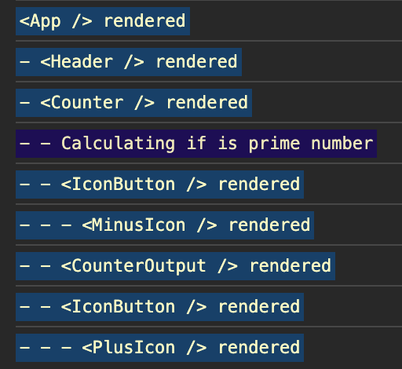
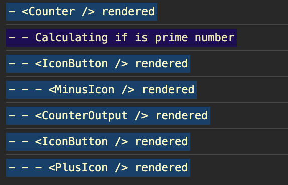

# React-Optimization-practice

## 리액트의 컴포넌트 렌더링 순서

이 프로젝트의 렌더링 순서와 트리는 이런식이다.  



## 최적화 방법

하나의 컴포넌트가 실행되면 그것의 모든 자식 컴포넌트가 재실행된다.

`<App>`에 있는 `input` 값 하나를 바꿨을 뿐인데, 위의 사진처럼 자식 컴포넌트까지 싹 다 재실행되는 사태가 벌어졌다.

이런 부분을 어떻게 개선하는 방법이 있을지 알아본다.

### 1. memo()

`memo()`로 감싼 컴포넌트의 속성값을 살펴본다.

해당 컴포넌트 함수가 재실행되면 새로 받을 속성 값을 살펴보고, 만약 속성 값들이 원래랑 동일하다면 (배열과 객체가 메모리 안에 있는 배열과 객체와 동일하다면) 이 컴포넌트 함수의 실행을 저지한다.

해당 컴포넌트 내부에서 변화가 일어나면 `memo()`의 기능이 작동하지 않고, 부모 컴포넌트로부터 재실행이 일어났을 때만 기능이 작동한다.

.png>)

`<Counter>` 컴포넌트를 `memo()`로 감쌌더니 그 하위 컴포넌트들이 재실행되지 않은 깔끔한 상황을 볼 수 있다.

> `memo()`로 감싸면, 리액트는 컴포넌트 함수 실행 전에 항상 속성을 확인해야 한다.  
> -> **_그만큼 성능에 부담을 주는 것이다._**  
> 따라서 모든 컴포넌트를 감싸면 안 되고, 속성 값이 자주 바뀌는 컴포넌트는 사용을 피하는 것이 좋다.

이렇게 간단한 앱에서는 솔직히 안 써도 될 만큼 성능에 큰 영향이 없다고 한다.

어찌됐든,  
사용하려면 `리렌더링을 방지할 수 있는 컴포넌트`와 `최대한 상위 컴포넌트` 트리에 있는 컴포넌트에서 사용하시기 바란대요.

### 2. 컴포넌트 분리

컴포넌트를 분리해서 다른 컴포넌트가 영향을 받지 않도록 만든다.


똑같이 입력창의 숫자 하나를 추가했는데, 분리한 그 컴포넌트만 리렌더되는 것을 볼 수 있다.

### 3. useCallback()

(의존성 배열 필요.)  
`함수의 재생성을 방지`하는 훅이다.  
가끔은 useEffect의 의존성으로 함수를 가지고 있을 때 필요하다.  
memo를 사용할 때도 불필요한 재실행을 방지하기 위해 필요하다.

`Increase`버튼만 눌렀을 뿐인데 다른 것들이 불필요하게 리렌더링 되고 있다.



`useState()`의 값이 바뀌면서 컴포넌트가 리렌더링 되고, 그러면서 내부 함수들이 다시 생성되니까 그 함수를 컨트롤하던 자식 컴포넌트들도 다 리렌더링 된 것이다.

그 함수들을 `useCallback()`으로 감싼다.  
(+ `<IconButton>` 컴포넌트를 memo로 감싸놨다.)

.png>)

리렌더링이 줄어들었다.

### 4. useMemo()

(의존성 배열 필요.)  
복잡한 연산이 있을 때만 사용해야 한다.

`memo()` 는 컴포넌트를 감쌀 때, `useMemo()` 는 컴포넌트 함수 안에 있는 일반 함수들을 감쌀 때. -> 감싼 함수의 결과값을 가져온다.

위 사진에서 `Calculating`이 실행되었다는 것을 볼 수 있는데, 이게 실행되어야하는 상황은 아니었다. 이것도 불필요하게 계속 재실행되고 있던 것이다.

`<Counter>` 컴포넌트의 `isPrime()` 함수를 `useMemo()` 로 감싸주었더니  

.png>)  

이렇게 리렌더링이 줄어들었다.

> 이걸 사용하면 추가적으로 `의존성 배열의 값 비교`를 실행하기 때문에 너무 남용하면 성능에 안 좋은 영향이 갈 수 있다.

### _!! 최적화를 도와주는 라이브러리 `Million.js` 도 있다 !!_

## useEffect() 사용을 피하게 해주는 패턴

```js
// Counter 컴포넌트

const [counterChange, setCounterChange] = useState(0);

useEffect(() => {
  setCounterChanges([{ value: initialCount, id: Math.random() * 1000 }]);
}, [initialCount]);
```

컴포넌트 내부에서 `useEffect()`를 이렇게 사용하려는 경우, 더 좋은 방식이 있다.

```js
// App 컴포넌트

const [chosenCount, setChosenCount] = useState(0);

<Counter key={chosenCount} initialCount={chosenCount} />;
```

이렇게 내장 속성인 `key` 속성을 이용하면 `chosenCount`가 바뀔 때 `<Counter>` 컴포넌트에도 변화가 감지되어 리렌더 된다.

## 가상 DOM

리액트는 가상 DOM을 이용해 실제로 업데이트해야 하는 DOM을 찾고 반영한다.  
가상 DOM은 메모리 안에서만 존재하고 실제 DOM을 사용하는 것보다 빠르다는 장점이 있다.

페이지를 새로고침 -> 리액트 앱 첫 렌더링 -> 리액트가 컴포넌트 트리 만듦 -> 이 트리로부터 실제 렌더링되어야 하는 HTML 코드를 전달 (아직 실제 DOM까지 안 감.) -> 가상 DOM 스냅샷 생성 -> 생성됐더 가장 마지막 스냅샷과 새로운 스냅샷 비교 -> 실제 DOM에 가서 변동 사항만 적용

## state 주의사항

### 스케쥴링

`setState()`는 곧바로 반영되는 것이 아니다.

```js
const [value, setValue] = useState(0);
function a(newValue) {
  setState(newValue);
  console.log(value);
}

a(10);
```

이렇게 하면 바로 10이 찍히는게 아니라 0이 찍힌다.

```js
const [value, setValue] = useState(0);
function a(newValue) {
  setState(newValue);
  setState((prev) => prev + 1);
  console.log(value);
}

a(10);
```

이렇게 함수형태로 불러와서 작성하면 newValue가 바로 반영된 결과를 얻을 수 있다.  
즉, `10+1`인 11의 결과를 얻을 수 있다.

하지만 밑에 줄에 있는 `console.log 결과는 11이 아니다.` 거기에는 반영되지 않는다.

### 배칭

같은 함수 내에서 위처럼 `setState()`가 여러개 있어도 컴포넌트 리렌더는 한 번만 일어난다.
